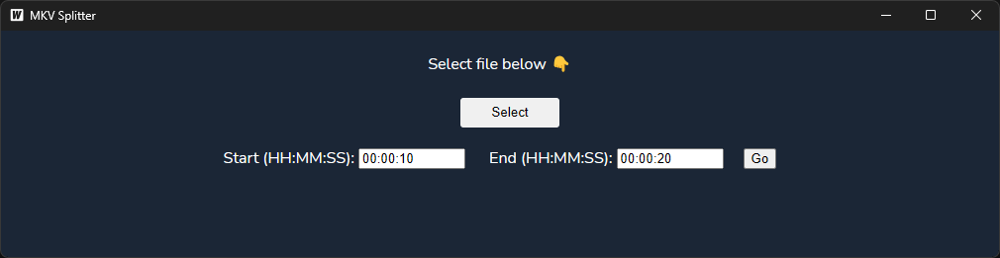

# MKV SPLITTER

The software allows to make **.mkv** files by time codes and convert them to **.mp4**

## Building
To run in live development mode, run `wails dev` in the project directory.
To build a redistributable, production mode package, use `wails build`.
